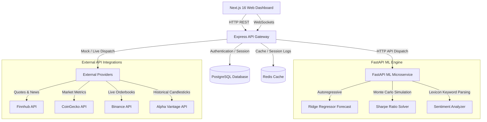

# MarketMind AI

> **Enterprise-Grade AI-Powered Stock & Cryptocurrency Analytics Platform**

MarketMind AI is a production-grade portfolio tracking and market analytics platform designed for high-performance stock and crypto research. Built on clean architecture principles, it combines real-time streaming, machine learning forecasting, quantitative portfolio optimization, and a premium glassmorphic dashboard.

---

## 🏗️ System Architecture



---

## ⚡ Key Features

* **clean architecture & Dependency Injection**: Pure domain models and repositories decoupled from databases and frameworks, utilizing a registry pattern to automatically switch between live and mock API providers.
* **Autoregressive Price Forecasting**: A custom time-series regression model running inside the Python FastAPI service that projects asset valuations for the next 7 days.
* **Modern Portfolio Theory (MPT) Optimizer**: A Markowitz Mean-Variance optimizer that executes Monte Carlo simulations on historical returns to calculate the Maximum Sharpe Ratio and Minimum Volatility allocation weights.
* **Real-time WebSockets Stream**: Bidirectional socket feeds broadcasting live market ticks, coupled with immediate UI color flashes and smooth client-side interpolation.
* **NLP Headline Sentiment Parsing**: An NLP lexicon engine mapping news feeds to aggregate bullish/bearish scores (-1.0 to +1.0) to model crowd sentiment.
* **JWT Access & Refresh Rotations**: Session manager tracking token reuse, password hashes, and admin audit logs.
* **Diagnostics Admin Panel**: Real-time server resource tracking, uptime, Node memory usage, and PostgreSQL database transaction logs.

---

## 🛠️ Technology Stack

| Layer | Technologies |
| :--- | :--- |
| **Frontend** | React 19, Next.js 16 (Turbopack), Tailwind CSS v4, TanStack Query v5, Recharts, Lucide, Framer Motion |
| **Backend Gateway** | Node.js 20, TypeScript, Express, Socket.IO, Prisma ORM, JWT, Zod Validation, Winston/Pino logging |
| **ML & Analytics** | Python 3.11, FastAPI, Scikit-learn, Pandas, NumPy, XGBoost, Uvicorn |
| **Services & Infrastructure** | PostgreSQL 15, Redis 7, Nginx Gateway, Docker & Docker Compose |

---

## 🚀 Getting Started

The easiest way to boot the complete environment is using Docker Compose:

### 1. Configure Environments
Copy the sample environment configuration file:
```bash
cp .env.example .env
```

### 2. Boot Databases
Initialize the PostgreSQL and Redis containers:
```bash
docker compose up -d db redis
```

### 3. Deploy Database Schema
Deploy database tables using the Prisma CLI inside the backend container:
```bash
docker compose run --rm backend npx prisma db push
```

### 4. Build and Run App Stack
Launch the frontend, backend gateway, and Python ML service:
```bash
docker compose up --build -d
```

Once started, the services are mapped to the following local URLs:
* **Frontend Web App**: `http://localhost:3001`
* **Express Backend Gateway**: `http://localhost:5001`
* **FastAPI ML Endpoint**: `http://localhost:8010`

---

## 🧪 Testing Suite

Run Jest unit tests to verify the core portfolio math, transaction fee computations, and database transaction mocks:
```bash
# Execute unit tests inside Node container
docker compose run --rm backend npm run test
```

---

## 📁 Repository Structure

```
marketmind-ai/
├── backend/            # Express, Node, and TypeScript REST + WebSocket server
├── frontend/           # Next.js 16, React 19 Client Dashboard
├── ml-service/         # Python FastAPI Regressions & Sharpe Solver
├── nginx.conf          # Nginx Reverse Proxy Config
└── docker-compose.yml  # Docker Orchestration Manifest
```
